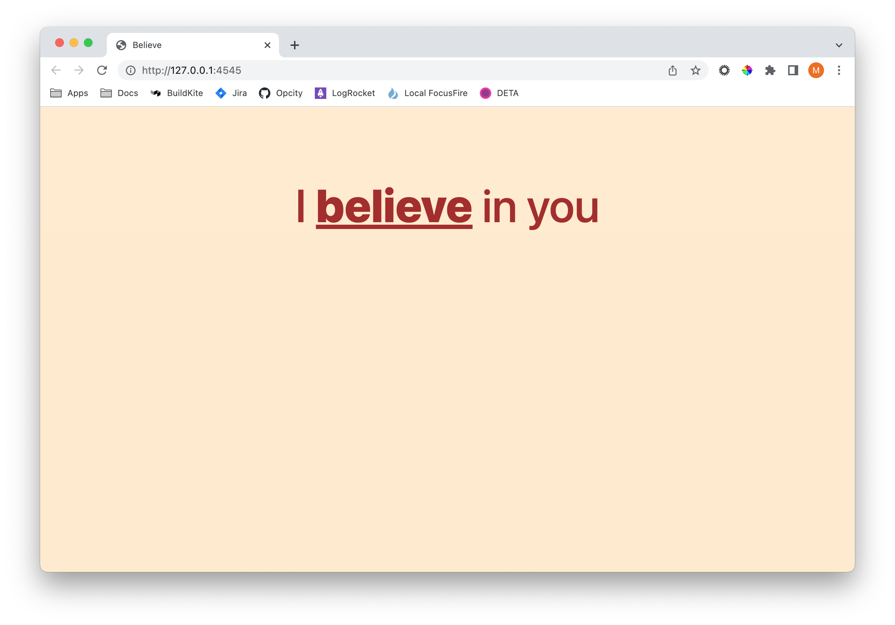

# An Encouraging Word

  

## What is this?

This is mostly an example app wherein I get to play with deploying a Flask application. It is tiny, but uses a Dockerized gunicorn insatnce to serve the app thereby making it trivial to deploy. The _Dockerfile_ and _run-prod.sh_ files are likely of the greatest interest in this repo.

## Why make this?

Beciase WSGI + Docker is a puzzler for me!

## How do I use this

### Pre-requisites 

- Well, first off you need _PyEnv_
- Next, you'll need _Docker_ running

### Steps

__DEV__

- `sh run-dev.sh`

__PROD__

- `sh run-prod.sh`

## Resources

Some links I used while miaking this. Be aware thes extent to which I used these items is not documented and a great deal of the works was done "by me" and by that I mean I looked at all or part of the resources listed and used some amount typically not all of the resource in question, but enopugh to want to credit the author with putting me on the right track. 

- https://www.freecodecamp.org/news/how-to-dockerize-a-flask-app/
- https://gunicorn.org/
- https://flask.palletsprojects.com/en/2.2.x/deploying/gunicorn/
- https://stackoverflow.com/questions/43925487/how-to-run-gunicorn-on-docker
- https://andybrewer.github.io/mvp/

## Ideas

Ideas I am toying with for this project!

- https://andy-bell.co.uk/cube-css/
- https://flask-login.readthedocs.io/en/0.4.1/#your-user-class
- https://twitter.com/piccalilli_
- https://eleventy-excellent.netlify.app/
- https://www.youtube.com/watch?v=5uhIiI9Ld5M
- https://learneleventyfromscratch.com/lesson/31.html#testing-our-production-task
- https://www.11ty.dev/